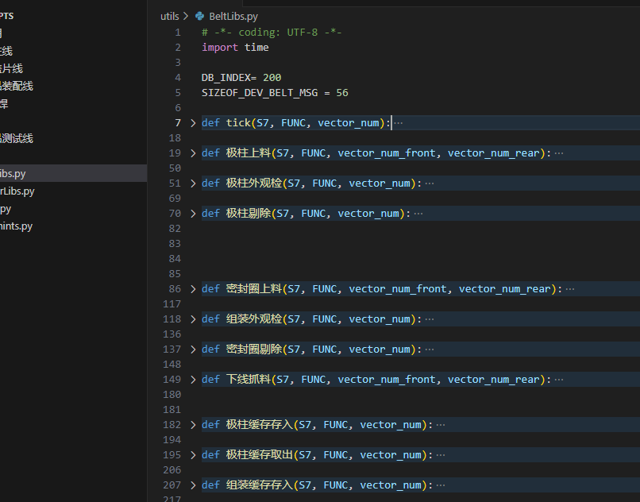
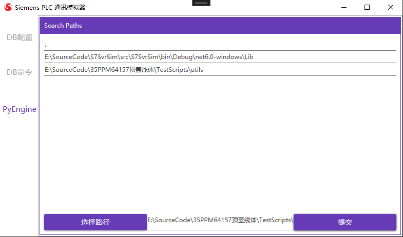

# S7 Server 通讯模拟器

*S7SvrSim* 是一个西门子 `S7`系列的`PLC`通讯模拟器。

## 这个程序是做什么的？

之所以有这样一个小项目，主要是为了缓解上位机开发人员想随时测试和`S7`系列PLC通讯的尴尬：

- 没有特定型号的物理`PLC`；或者有相关型号的`PLC`，却没带在手边
- 没钱购买博图，又不屑于使用盗版
- 有钱购买博图，但是这个软件超大，还会自动安装了一堆WinCC/SQL Server之类服务。偏偏自己对电脑还有洁癖。
- 有钱买了博图，然后废了老大劲安装好了，却不一定有权限拿到电气部门的`PLC`程序。
- 拿到了电气部门的程序，发现他们的程序还没写好，跑不起来
- ...

回过头来想，上位机开发人员真的需要物理PLC或者博图吗？我们只需要一个`西门子 PLC`**S7通讯模拟器**而已！我们甚至不需要模拟完整的`PLC`程序，我们仅仅只需要根据和电气部门的通讯规约操作点表！对，只需要**模拟通讯**。

当然，**如果上面所列的场景不适合你，那么你没必要用这个程序** :) 

## 这个程序不能干什么

我不打算、也没能力做一个完整的软`PLC`。像画各种梯形图、执行ST程序这种事，压根不是这个项目的目标。

## 安装和启动

由于前端是使用 `WPF`开发的，故目前只能在Windows上使用（后期可能会考虑做成跨平台的，但是暂时没有这个动力）。

<del>使用该工具最简单的方法是使用`ClickOnce`技术来安装，只需打开如下`URL`即可（需要Windows操作系统）：</del>

<del>https://assets.chiyiqian.net/S7SvrSim/S7SvrSim.application</del>

(有个别同事使用最新的`Win11`打开`ClickOnce`有问题，所以不再提供ClickOnce方式安装)

请到本项目的Release下，直接下载对应的zip包即可。

启动程序后，在 **DB配置** 界面中:
- 设置好要监听的IP地址，
- 配置一个或者多个`DB`的号码、大小
- 点击 **"启动"** 按钮

### 功能

1. 本质上，这是S7 Server通信模拟器，可以简单把它当成采用S7通信时上位机所连的PLC。
2. 提供DB、MB操作接口。

### 操作方式

*S7SvcSim* 支持单步操作和基于`Python`脚本的批量操作。其中，单步操作主要是为了方便手动调试。

更多的时候，为了减少重复工作，我们会编写一些`Python`脚本来实现自动化测试。

```python
# -*- coding: UTF-8 -*-
import time
import shell  

DB_INDEX= 200
OFFSET_FLAGS_BASE = 1082  
SIZEOF_DEV_BELT_MSG = 56

FUNC = shell.accept_input_int("请选择皮带线： 1-belt1; 2-belt2; 3-belt3; 4-belt4")
if FUNC < 1 and FUNC > 4 :
    shell.show_message_box("请选择正确的皮带线！")
else:
	# 计算地址偏移
    OFFSET_FLAGS = OFFSET_FLAGS_BASE + (FUNC - 1) * SIZEOF_DEV_BELT_MSG
    OFFSET_VEC_NUMBER = OFFSET_FLAGS + 1

	# 让用户输入来料信息
    vector_num = shell.accept_input_int("incoming vector number")

    DB.WriteByte(DB_INDEX, OFFSET_VEC_NUMBER , vector_num)
    DB.WriteBit(DB_INDEX, OFFSET_FLAGS, 0, True)

	# 3s后清除信号
    time.sleep(3)
    DB.WriteByte(DB_INDEX, OFFSET_VEC_NUMBER , 0)
    DB.WriteBit(DB_INDEX, OFFSET_FLAGS, 0, False) 
```

> 注：这里的`shell`是用户自定义的模块。

有了这些测试脚本，我们只需要在合适的时间点导入这些脚本即可自动完成动作模拟。(更多示例参考 `docs/sample scripts`文件夹)


### Python的版本支持

底层用的是`IronPython`，<del>由于到目前为之，`IronPython 3.x`尚未成熟，故这里`IronPython`的版本是`2.7.11`。</del>

<del>这意味着：</del>
- <del>只能使用 **Python2.x** 的语法和特性</del>
- <del>如果要写中文，应该指定文件编码 `# -*- coding: UTF-8 -*-`</del>


从0.4.0开始，使用`IronPython 3.4.1`

### 自定义模块的检索路径

我们可以定义一些公共模块到一些单独的文件下:


然后通过在`PyEngine/SearchPaths`界面中，点击 **"选择路径"**，来导入自定义的检索路径：



### 清空数据

点击 **"DB配置"** 里的 **停止**、**"启动"** 会清空当前模拟器中的数据。

### Python 脚本

用户可以自定义一个`Python`脚本，然后在程序运行后导入。一旦导入，该脚本就会被立刻执行。
为了操作模拟器，我向`Python`暴露了一个预定义的`S7`对象(类型为`IS7ServerService`)，用于对当前正在运行的 **S7 PLC模拟器** 进行操作。

通过这些API方法，我们可以通过编写`Python`脚本来动态执行一系列操作，比如：

```python
DB.WriteString(200, 2000, 40, "abcdefghijklmn")
DB.WriteBit(200, 2060, 0, True)
DB.WriteShort(200, 2062, 1)
```

### API

#### `S7`

Python可以使用的`DB`其实是一个`IS7DataBlockService`接口对象：

```C#
public interface IS7DataBlockService
{
    bool ReadBit(int dbNumber, int offset, byte bit);
    void WriteBit(int dbNumber, int offset, byte bit, bool flag);

    byte ReadByte(int dbNumber, int pos);
    void WriteByte(int dbNumber, int pos, byte value);

    short ReadShort(int dbNumber, int pos);
    void WriteShort(int dbNumber, int pos, short value);

    uint ReadUInt32(int dbNumber, int pos);
    void WriteUInt32(int dbNumber, int pos, uint value);

    ulong ReadULong(int dbNumber, int pos);
    void WriteULong(int dbNumber, int pos, ulong value);
    
    float ReadReal(int dbNumber, int pos);
    void WriteReal(int dbNumber, int pos, float real);

    string ReadString(int dbNumber, int offset);
    void WriteString(int dbNumber, int offset, int maxlen, string str);
}
```

而`MB`则是一个`IS7MBService`:
```C#
public interface IS7MBService
{
    bool ReadBit(int offset, byte bit);
    void WriteBit(int offset, byte bit, bool flag);

    byte ReadByte(int pos);
    void WriteByte(int pos, byte value);

    short ReadShort(int pos);
    void WriteShort(int pos, short value);

    uint ReadUInt32(int pos);
    void WriteUInt32(int pos, uint value);

    ulong ReadULong(int pos);
    void WriteULong(int pos, ulong value);

    float ReadReal(int pos);
    void WriteReal(int pos, float real);

    string ReadString(int offset);
    void WriteString(int offset, int maxlen, string str);
}
```

#### `Logger`

还暴露一个`Logger`对象，用于追加日志：
```c#
void LogInfo(string content);
void LogError(string content);
```


## 已知问题

- [X] <del>由于[#44602](https://github.com/dotnet/runtime/issues/44602#issuecomment-726472185) 这个问题，目前没法使用`ClickOnce`发布</del>。2021-01-16：#44602 号问题已在 *VS16.8.4* 中修复，参见[VS Developer Community](https://developercommunity2.visualstudio.com/t/A-NET-Core-31-or-NET-50-application-/1248873)
- [X] <del>目前由于[`IronPython`](https://ironpython.net/)的限制，发布时无法生成单个文件。参见[IronPython #762](https://github.com/IronLanguages/ironpython2/issues/762)。故发布项目时请不要使用`-p:PublishSingleFile=true`。</del>