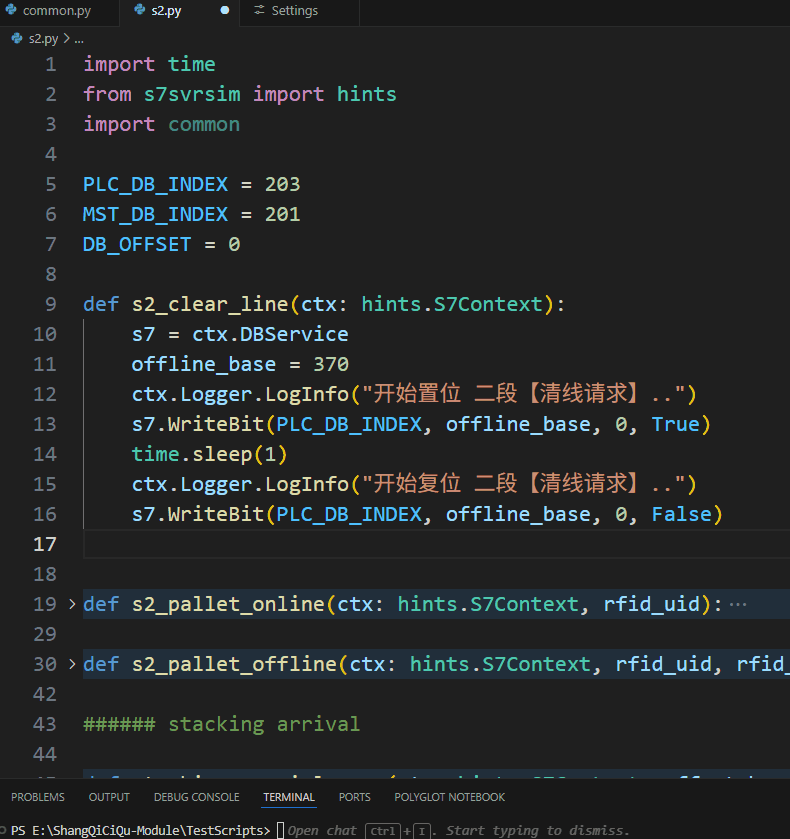

# S7 Server 通讯模拟器

*S7SvrSim* 是一个西门子 `S7`系列的`PLC`通讯模拟器。

## 这个程序是做什么的？

1. 本质上，这是S7 Server通信模拟器。你可以把它当成采用S7通信时上位机所连的西门子PLC。
2. 提供一个简易的图形界面，方便临时操作单个点位。
3. 提供一个方便的**脚本环境**，方便上位机开发人员使用Python编写自动化测试脚本。

之所以有这样一个小项目，主要是为了缓解上位机开发人员想随时测试和`S7`系列PLC通讯的尴尬：

- 没有特定型号的物理`PLC`；或者有相关型号的`PLC`，却没带在手边
- 没钱购买博图，又不屑于使用盗版
- 有钱购买博图，但是这个软件超大，还会自动安装了一堆WinCC/SQL Server之类服务。偏偏自己对电脑还有洁癖。
- 有钱买了博图，然后废了老大劲在虚拟机里安装好了，却不一定有权限拿到电气部门的`PLC`程序。
- 拿到了电气部门的程序，发现他们的程序还没写好，跑不起来
- ...

回过头来想，上位机开发人员真的需要物理PLC或者博图吗？我们只需要一个`西门子 PLC`**S7通讯模拟器**而已！我们甚至不需要模拟完整的`PLC`程序，我们仅仅只需要根据和电气部门的通讯规约操作点表！对，只需要**模拟S7通讯**。

当然，**如果上面所列的场景不适合你，那么你没必要使用这个程序** :) 

## 这个程序不能干什么

我不打算、也没能力做一个完整的软`PLC`。像画各种梯形图、执行ST程序这种事，压根不是这个项目的目标。

## 安装和启动

由于前端是使用 `WPF`开发的，故目前只能在Windows上使用（后期可能会考虑做成跨平台的，但是暂时没有这个动力）。

<del>使用该工具最简单的方法是使用`ClickOnce`技术来安装，只需打开如下`URL`即可（需要Windows操作系统）：</del>

<del>https://assets.chiyiqian.net/S7SvrSim/S7SvrSim.application</del>

(有个别同事使用最新的`Win11`打开`ClickOnce`有问题，所以不再提供ClickOnce方式安装)

请到本项目的Release下，直接下载对应的zip包即可。

启动程序后，在 **DB/MB配置** 界面中:
- 设置好要监听的IP地址，
- 配置一个或者多个`DB`的号码、大小
- 点击 **"启动"** 按钮


### 操作方式

*S7SvcSim* 支持单步操作和基于`Python`脚本的批量操作。其中，单步操作主要是为了方便手动调试。更多的时候，为了减少重复工作，我们会编写一些`Python`脚本来实现自动化测试。

一个十分简单的测试脚本类似于：
```python
import time
from s7svrsim import hints


# main 函数是测试入口，固定接受一个ctx参数
def main(ctx :hints.S7Context):
    logger = ctx.Logger                   # 别担心这里的名字，我提供了智能提示
    s7 = ctx.DBService                    # 别担心这里的名字，我提供了智能提示

    logger.LogInfo("wait for DB201.1.1")  # 别担心这里的函数名和参数，我提供了智能提示
    flag = s7.ReadBit(201, 1, 1)          # 从 DB201.1.1 读取一个位（有智能提示）
    if flag:
        s7.WriteUInt32(202, 100, 10001)   # 向 DB202.100 写入 10001（有智能提示）
    logger.LogInfo("done")                # 别担心这里的函数名和参数，我提供了智能提示
```

这里的 **`main(ctx)`** 是一个测试脚本的入口，由模拟器进行调用，其中`ctx` 是一个`S7Context`类型的参数：

```c#
public record S7Context(
    IS7DataBlockService DBService, 
    IS7MBlock MB, 
    MsgLoggerVM Logger, 
    CancellationToken CancellationToken
    );
```

> 早期，为了简单，我们可以直接在脚本中编写测试代码，而无需把测试代码定义在 `main(ctx)`函数中。如今，我认为这是一种糟糕的设计。
> 虽然我们现在仍然兼容这一种写法，但是不再建议，将来我们会合适的时候移除这种支持。

在实际项目中，我很少会去使用单个点位的操作界面。相反，我会直接编写`Python`模拟各种场景下的行为。比如使用`while`循环来轮询，并搭配特定的握手信号做出相应的动作。我也经常使用`Python`操作`WPF`，触发一个弹窗来接收各类用户输入。

编写脚本带来的好处是十分明显的，我可以将交互逻辑保存成文件，用git管理，在遇到上位机调度、排产、业务逻辑变化时，随时调起脚本重新测试。

#### 监看

除了上面提到的单个点位操作、Python脚本支持，[studylessshape](https://github.com/studylessshape)还为这个项目实现了“监看”功能，类似于博图中的DB监视+编辑功能，十分趁手。

### Python的版本支持

底层用的是`IronPython`，这意味着有一些可能有一些兼容性问题。

> 我目前遇到过的一个问题是，`.NET`中创建的整数，自动装箱后(object)，在`IronPython`中一些较新的格式化场景(`f-string`)不符合预期。

但是，目前来说够用就好。世上没有完美的语言，更不会有完美的运行时；就算有，也不可能等到全部准备好再开始我们的工作。
也许将来我会换成 `Python.NET` 之类的实现，甚至换成`C#`脚本。不过，对于现在而言，放过自己，承认不完美，享受生活！

### 智能提示

`Python`的静态检查能力只能算中下水平，有时候用一个脚本模拟联调，跑了十几分钟后才发现其中有一个变量的大小写搞错了。我经常忘掉那些类型名称或者预定义的变量名称，然后又要打开之前写的脚本手动复制，这种无形之中加重了这种心理负担，总怀疑哪里可能会有问题。

所以，智能提示至关重要。我为这个模拟器添加了一个类型提示包：[s7svrsim](https://pypi.org/project/s7svrsim/)，以减轻大家的记忆负担。

安装`s7svrsim`：
```
pip install s7svrsim
```

编写脚本的时候，导入提示：
```
from s7svrsim import hints
```

然后你就可以使用类型提示了：




#### vscode + uv 示例

1. `uv init`
2. `uv add s7svrsim` 
3. `vscode` 中 `select python interpreter` 选择 `uv` 创建的虚拟环境
4. 使用 `hints.S7Context` 来获得智能提示

### 自定义模块的检索路径

随着项目测试脚本的越来愈多，我们通常会把代码拆成一个个独立的小模块，然后就可以在测试文件中导入这些模块。当然，为了让模拟器知道模块所在路径，在运行我们的测试脚本之前，我们需要在`PyEngine |> SearchPaths`界面中，点击 **"选择路径"**，来导入自定义的检索路径：


### 清空数据

点击 **"DB配置"** 里的 **停止**、**"启动"** 会清空当前模拟器中的数据。这是`by-design`行为。

### API

用户提供的`Python`测试脚本中，需要定义一个`main(ctx)`函数：

```python
def main(ctx: hints.S7Context):
    ...
```

这里的`ctx`提供几个属性：
- `DBService`: 一个`IS7DataBlockService`接口对象
- `MB`: 一个`IS7MBService`接口对象
- `Logger`: 一个日志对象，用于在界面中打印日志
- `CancellationToken`：用于从外部取消当前任务。

#### `S7`

Python测试脚本的卖弄可以使用的`DB`其实是一个`IS7DataBlockService`接口对象：

```C#
public interface IS7DataBlockService
{
    bool ReadBit(int dbNumber, int offset, byte bit);
    void WriteBit(int dbNumber, int offset, byte bit, bool flag);

    byte ReadByte(int dbNumber, int pos);
    void WriteByte(int dbNumber, int pos, byte value);

    short ReadShort(int dbNumber, int pos);
    void WriteShort(int dbNumber, int pos, short value);

    ushort ReadUShort(int dbNumber, int pos);
    void WriteUShort(int dbNumber, int pos, ushort value);

    uint ReadUInt32(int dbNumber, int pos);
    void WriteUInt32(int dbNumber, int pos, uint value);

    ulong ReadULong(int dbNumber, int pos);
    void WriteULong(int dbNumber, int pos, ulong value);

    float ReadReal(int dbNumber, int pos);
    void WriteReal(int dbNumber, int pos, float real);

    double ReadLReal(int dbNumber, int pos);
    void WriteLReal(int dbNumber, int pos, double real);

    string ReadString(int dbNumber, int offset);
    void WriteString(int dbNumber, int offset, int maxlen, string str);

    int ReadInt(int dbNumber, int pos);
    void WriteInt(int dbNumber, int pos, int value);
}
```

而`MB`则是一个`IS7MBService`:
```C#
public interface IS7MBService
{
    bool ReadBit(int offset, byte bit);
    void WriteBit(int offset, byte bit, bool flag);

    byte ReadByte(int pos);
    void WriteByte(int pos, byte value);

    short ReadShort(int pos);
    void WriteShort(int pos, short value);

    ushort ReadUShort(int pos);
    void WriteUShort(int pos, ushort value);

    uint ReadUInt32(int pos);
    void WriteUInt32(int pos, uint value);

    ulong ReadULong(int pos);
    void WriteULong(int pos, ulong value);

    float ReadReal(int pos);
    void WriteReal(int pos, float value);

    double ReadLReal(int pos);
    void WriteLReal(int pos, double value);

    string ReadString(int offset);
    void WriteString(int offset, int maxlen, string str);
    int ReadDInt(int pos);
    void WriteDInt(int pos, int value);
}
```

#### `Logger`

还暴露一个`Logger`对象，用于追加日志：
```c#
void LogInfo(string content);
void LogError(string content);
```

#### 取消任务

`ctx`参数暴露一个`CancellationToken`属性，当用户从外部（比如界面按钮）取消任务时，`CancellationToken`会触发取消事件。

> 注意：正确响应取消事件，是脚本的编写者的责任。

比如我们可以编写一个轮询直至满足条件的高阶函数：
```python
def block_and_poll(predicate, ct: hints.CancellationToken):

    while True:
        ct.ThrowIfCancellationRequested()  # 检测取消事件
        condition = predicate()
        if not condition:
            time.sleep(0.02)
            continue
        break
```
这个函数会定期调用`predicate()`函数，如果返回`True`，则跳出循环；当检测到令牌被取消，则会直接抛出请求已取消的异常。

> 你可能会想：这种取消任务的机制是把麻烦丢给了脚本编写者。从某种程度上，的确是这样。
> 上古时代的`.NET Framework`支持`Thread.Abort()`方法，但是`.NET Core`已经废弃了这个方法。我们当然可以通过多进程+kill的方式模拟，但是如此一来，没人知道那个被杀掉的进程做到了哪一步、改动了哪些东西。这种不确定性会带来焦虑和不安。
> 何况如果kill是一个好的设计，`.NET Core`的`async-await`异步编程就不会蔓延着`CancellationToken`参数了。


## 已知问题

- [X] <del>由于[#44602](https://github.com/dotnet/runtime/issues/44602#issuecomment-726472185) 这个问题，目前没法使用`ClickOnce`发布</del>。2021-01-16：#44602 号问题已在 *VS16.8.4* 中修复，参见[VS Developer Community](https://developercommunity2.visualstudio.com/t/A-NET-Core-31-or-NET-50-application-/1248873)
- [X] <del>目前由于[`IronPython`](https://ironpython.net/)的限制，发布时无法生成单个文件。参见[IronPython #762](https://github.com/IronLanguages/ironpython2/issues/762)。故发布项目时请不要使用`-p:PublishSingleFile=true`。</del>
